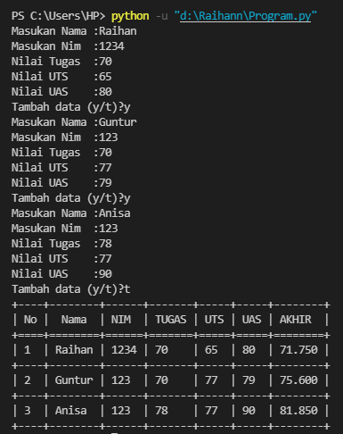
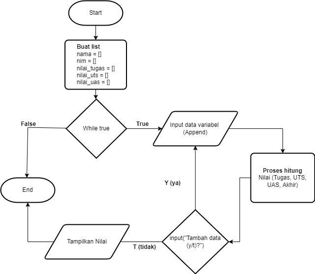
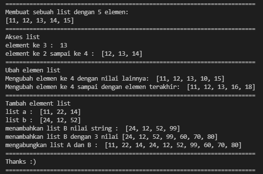

# Praktikum4
## Tugas Pertemuan 9 - Bahasa Pemrograman

### 1. File program
Program ini adalah program sederhana untuk menambahkan data kedalam sebuah list dengan menggunakan module texttable pada python.

* **CODINGAN:**
```
  from texttable import Texttable

 table = Texttable ()
 jawab = "y"
 no = 0
 nama = []
 nim = []
 nilai_tugas = []
 nilai_uts = []
 nilai_uas = []
 while(jawab == "y"):
     nama.append(input("Masukan Nama :"))
     nim.append(input("Masukan Nim  :"))
     nilai_tugas.append(input("Nilai Tugas  :"))
     nilai_uts.append(input("Nilai UTS    :"))
     nilai_uas.append(input("Nilai UAS    :"))
     jawab = input("Tambah data (y/t)?")
     no += 1
 for i in range(no):
     tugas = int(nilai_tugas[i])
     uts = int(nilai_uts[i])
     uas = int(nilai_uas[i])
     akhir = (tugas*30/100) + (uts*35/100) + (uas*35/100) 
     table.add_rows([['No','Nama','NIM','TUGAS','UTS','UAS','AKHIR'],[i+1, nama[i],nim[i],nilai_tugas[i],nilai_uts[i],nilai_uas[i],akhir]])                                                                                                                                                                                                                                                                                                                                                
 print (table.draw())
```

* **Hasil output program:**



* **Flowchart:**



* **Penjelasan program:**

Install terlebih dahulu module texttable dan PIP (Package) 

Pada langkah pertama kita perlu meng-import module yang telah di install dengan kodingan seperti dibawah ini.
```
 from texttable import Texttable
```

Lalu membuat sebuah list dengan variable seperti berikut.
```
 table = Texttable ()
 jawab = "y"
 no = 0
 nama = []
 nim = []
 nilai_tugas = []
 nilai_uts = []
 nilai_uas = []
```

Langkah selanjutnya membuat sebuah pengulangan dengan menggunakan perintah *while*, Dengan variable jawab yang berinput "y" bertujuan untuk mengulang pertanyaan.
```
 while(jawab == "y"):
```

Method list.append(obj) digunakan untuk menambahkan object obj ke dalam sebuah list pada kolom tabel.
```
 nama.append(input("Masukan Nama :"))
      nim.append(input("Masukan Nim  :"))
      nilai_tugas.append(input("Nilai Tugas  :"))
      nilai_uts.append(input("Nilai UTS    :"))
      nilai_uas.append(input("Nilai UAS    :"))
```

kodingan tesebut menghasilkan output dengan pertanyaan yang bertujuan untuk menambahkan data, jika jawab "y" maka pertanyaan akan terulang kembali dan diinput kembali seperti sebelumnya, jika menjawab "t" maka program tersebut akan berhenti secara otomatis dan menghasilkan ouput dari hasil yang telah diinput. dengan cara tersebut kita bisa menginput lebih dari 1 inputan atau sesuai dengan yang kita inginkan.
```
 jawab = input("Tambah data (y/t)?")
     no += 1
 for i in range(no):
 ```

kodingan tersebut merupakan sebuah output yang menghasilkan kolom tabel yang didalamnya berisikan Variable yang telah diinput seperti Nama, Nim, Nilai tugas, Nilai Uts, Nilai Uas, dan Nilai Akhir. pada perintah table.add_row' berguna menambahkan baris pada tabel, serta untuk perhitungan nilai akhir menggunakan operator aritmatika perkalian dan penjumlahan.
```
 tugas = int(nilai_tugas[i])
     uts = int(nilai_uts[i])
     uas = int(nilai_uas[i])
     akhir = (tugas*30/100) + (uts*35/100) + (uas*35/100) 
     table.add_rows([['No','Nama','NIM','TUGAS','UTS','UAS','AKHIR'],[i+1, nama[i],nim[i],nilai_tugas[i],nilai_uts[i],nilai_uas[i],akhir]])        
```     

### 2. File Latihan

* **CODINGAN:**
```
 #List dengan 5 elemen
 print("="*73)
 nilai = [11, 12, 13, 14, 15]
 print("Membuat sebuah list dengan 5 elemen: ")
 print(nilai[0:6])
 print("="*73)

 #Akses pada list
 print("Akses list")
 print ("element ke 3 : ", nilai[2])
 print ("element ke 2 sampai ke 4 : ", nilai[1:4])
 print("="*73)

 #mengubah element list
 print("Ubah elemen list")
 odd = [11,12,13,14,15]
 odd[3] = 10
 print("Mengubah elemen ke 4 dengan nilai lainnya: ", odd)

 #Mengubah elemen ke 4 sampai dengan elemen terakhir
 odd[3:5] = [16,18]
 print("Mengubah elemen ke 4 sampai dengan elemen terakhir: ",odd)
 print("="*73)

 #menambahkan element
 print("Tambah element list")
 nilaia = [11,22,14]
 nilaib = [24,12,52]
 print("list a : ", nilaia)
 print("list b : ", nilaib)
 nilaib.append(99)
 print ("menambahkan list B nilai string : ", nilaib)
 nilaib.extend([60,70,80])
 print ("menambahkan list B dengan 3 nilai", nilaib)
 print ("mengabungkan list A dan B : " ,nilaia + nilaib)
 print("="*73)
 print("Thanks :)")
 print("="*73)
```

* **Hasil output program:**


